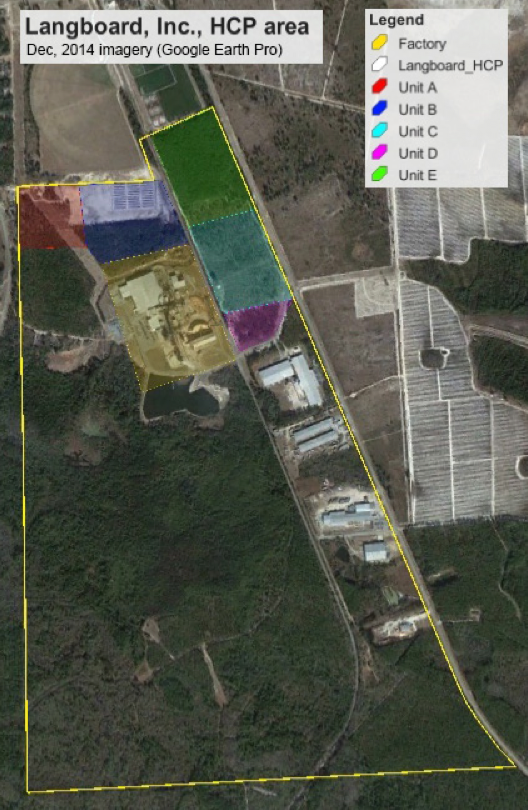
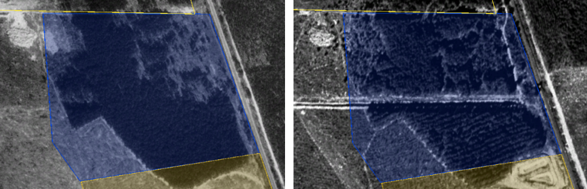
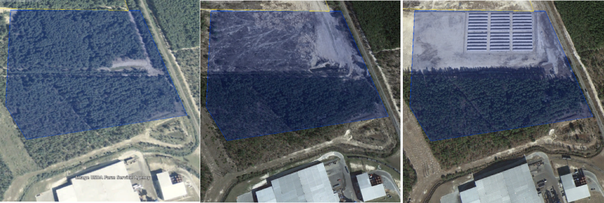
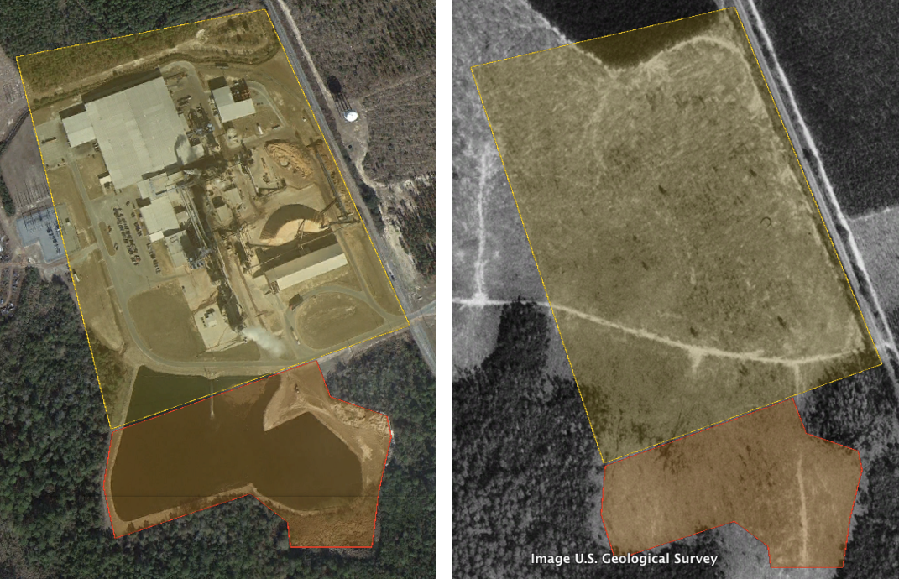
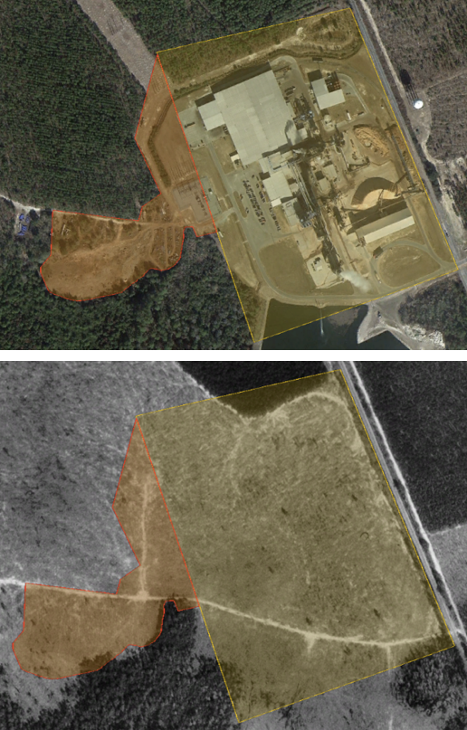
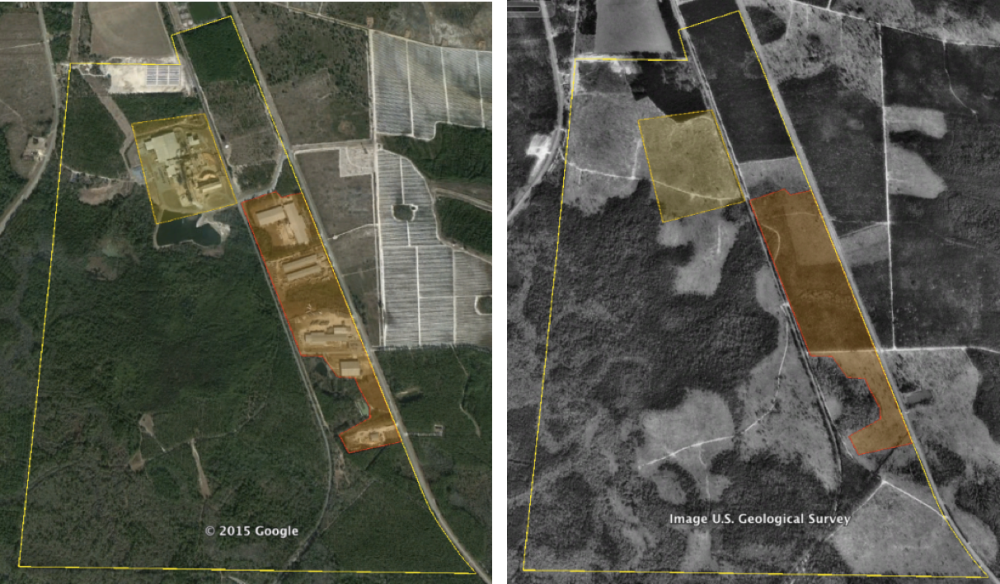
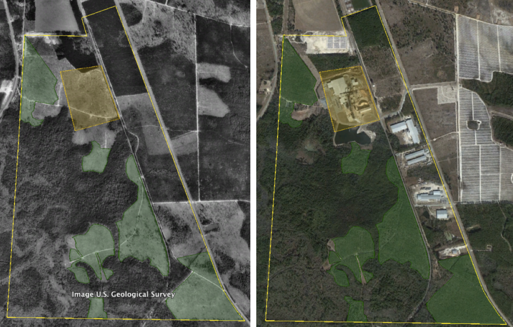

## Summary

Habitat Conservation Plans (HCPs) permit non-federal landowners to develop their land and potentially harm species listed under the Endangered Species Act (ESA) in return for conservation actions that benefit the species. While permittees are required to submit monitoring reports, HCPs should be subject to independent monitoring to ensure compliance. The Langboard HCP accompanies a 30-year (1997-2027) Incidental Take Permit (ITP) for indigo snakes (_Drymarchon couperi_) on 45.29 acres of the Langboard, Inc., particle board facility in Willacoochee, Georgia. We used freely available aerial imagery from 1993-2014 to show that Langboard, Inc., has cleared ~14.2 acres of mitigation habitat, in potential violation of the permit. In addition, ~23.3 acres have been cleared immediately adjacent to the area covered by the ITP, as have ~65.7 acres on other areas of the property. These blocks, plus several others not directly addressed in the HCP, total ~150 acres that have been developed at the property. During the same time span, ~150 acres of previous pasture habitat have been reforested on the property. This review underscores the value and ease of using free remotely sensed imagery to monitor the status of permitted activities. Furthermore, the U.S. Fish and Wildlife Service should revisit the Langboard HCP to determine a proper course of action for potential violation of the terms of the ITP.

## Background

Section 10 of the [Endangered Species Act (ESA)](www.nmfs.noaa.gov/pr/laws/esa/text.htm) created a way for non-federal entities - private citizens, researchers, county and state governments, etc. - to harm ESA-listed species in return for actions that benefit the listed species.  One way section 10 is implemented is through [Habitat Conservation Plans (HCPs)](https://www.fws.gov/endangered/what-we-do/hcp-overview.html), which detail where and how the permittee may modify or destroy habitat and potentially harm ESA-listed species as well as the conservation actions they will undertake elsewhere. As part of the HCP, permittees are required to submit annual monitoring reports that detail development that has occurred, conservation actions completed, and related content. Rather than rely solely on an honor system in which government agencies assume the monitoring reports are true, HCPs should be subject to independent monitoring to ensure compliance. 

In July 1997, [Langboard, Inc., submitted an HCP](https://osf.io/rpvjq/) for the indigo snake (_Drymarchon couperi_) on their 723-acre property south of Willacoochee, Georgia (Figure 1). On 15 November 1997, the U.S. Fish and Wildlife Service (Service) granted an [Incidental Take Permit (ITP)](https://osf.io/ugaem/) to cover incidental take of indigo snakes during construction and operation of a particle board manufacturing facility by the applicant. The ITP covers 45.29 acres (Covered Area) for construction of the facility and the entrance road, and requires Langboard to restore 59 acres of habitat—in three blocks, labeled B, C, and D—for the benefit of the indigo snake as mitigation. The ITP has a 30-year duration (until 15 November 2027) and is renewable.

#### Figure 1. The Langboard, Inc., property

----

## Methods

I used aerial imagery and basic GIS tools (Google Earth Pro) to investigate whether Langboard, Inc., had complied with the terms of the ITP through December 2014. First, I used Figure 3 from the HCP to closely approximate Langboard’s property boundaries, the boundaries of the five habitat Units (A-E) discussed in the HCP, and the Covered Area (i.e., the factory footprint, yellow background in Figure 1). In addition to using road characteristics, visible forest breaks, and other details of the December 2014 imagery, I referenced imagery from January 1993 to determine the most probable corners of each polygon. The areas of the estimated polygons are highly similar to the areas presented in the HCP, but are likely not exact. 

## Results

### Potential Violation in Unit B

Initial inspection of the imagery and polygons suggested that Langboard, Inc., may have violated the terms of the ITP. The area with the most likely violation is Unit B, which encompasses 25 acres and was designated as a block for habitat restoration for indigo snakes. There, the dense pine trees in the block were to be the subject of thinning to “encourage herbaceous growth”. This thinning was performed, as is evident by comparing 1993 and 1999 imagery (Figure 2).

#### Figure 2. Unit B, 1993-1999 comparison

----

However, between December 2010 and March 2013, the northern half of Unit B was cleared, and by December 2014 the area had been developed with a series of 36 long, rectangular structures (Figure 3). The developed area encompasses ~14.2 acres, or over half the area of Unit B.

#### Figure 3. Unit B, 2010-2014 comparisons

----

Loss of over half of Unit B habitat should qualify as a “major revision” to the terms of the ITP. While minor revisions can be made by the Service and the permittee, major revisions require notice in the _Federal Register_. I searched for any mention of Langboard in the _Federal Register_ and through the Service’s ECOS portal, but there were no matches beyond the 1997 HCP. 

### Additional habitat loss

The HCP discusses the entire Langboard property, but the ITP covers only the factory footprint (Covered Area) and the five mitigation Units. The “fuzziness” of the descriptions creates a problem for understanding whether the habitat disturbances described below resulted in violations of the ITP. If the disturbances do not fall within the boundaries of the Covered Area, then they did not violate the ITP but may have occurred without incidental take authorization (and thus violated section 9 of the ESA). One might argue that those disturbances occurred on already developed sites (pasture) that were not indigo habitat at the time; hence, the disturbances were not prohibited under section 9. But if that is true, why did Langboard obtain an HCP in the first place, as the factory site (Covered Area) was also pasture when the HCP was drafted?  These are the types of questions we can begin asking by taking advantage of remotely-sensed data for monitoring. 

The first disturbance is a large holding pond to the south of the factory falls well-outside the Covered Area for the factory (Figure 4). The pond and the disturbed areas immediately adjacent to the pond cover an estimated 11.4 acres outside of the Covered Area. Construction and maintenance of this pond required destruction of potential indigo snake habitat totaling ~25% of the area allowed under the ITP. The HCP specifically notes that the applicants did not want to perform any work that would require Clean Water Act Section 404 permitting, but the pond occurs in a general area identified as wetland in Figure 2 from the HCP. However, the vegetation in the 2014 imagery suggests that the closest wetland area is still ~300 feet from the pond, and it seems unlikely that a CWA violation occurred.

#### Figure 4. The Langboard holding pond

----

Second, the area west of the factory and Covered Area has been severely degraded, and appears to be dumping ground for various industrial hardware (Figure 5). This area encompasses ~11.9 acres of upland substrate, but, like the pond area of Figure 4, was cleared land in 1993. There may have been gopher tortoise (_Gopherus polyphemus_) burrows in this area during the initial survey described in the HCP, but the general habitat was not suitable for the tortoise or the snake at the time. Judging from reforestation on other parts of the property (discussed below), this area may have become suitable snake and tortoise habitat in the intervening 15 years. The combined pond and west areas increase the footprint of the factory by ~50% above the area allowed under the ITP.

#### Figure 5. West of the Langboard factory

----

### Apparent land transfers

While the HCP focused mainly on the northern half of the 723-acre property, the southern half contains both wetland and upland habitats that should be considered suitable indigo snake habitat. It is unclear from the HCP text why no other areas were considered for coverage, but the available imagery clearly shows additional habitat losses, totaling ~65.7 acres, within the property boundary (Figure 6).

#### Figure 6. Development outside of HCP units

----

Nearly 150 acres of indigo snake habitat or possible habitat have been developed within the property described by the Langboard HCP, but only 45.29 acres were covered by the associated ITP. Of this area, patterns of land use in Unit B and along the eastern edge of the property suggest that these lands may no longer be owned by Langboard. For example, the east-west road bisecting Unit B in Figure 4 appears between 1993 and 1999; the loss of habitat in the northern half occurs only north of that road, and there appears to be a fence along the north side of the road. The four sets of buildings along the eastern edge of the property appear to not be fiber board manufacturers—imagery analysis suggests a manufactured home builder, a trucking company, and other industrial sites—but at least one (TLC Mouldings)[http://www.tlcmouldings.com] is currently labeled as a “Langdale Company.” The presence of individual entrances and apparent separation of the properties by fences further supports the idea that these developed areas are not strictly part of Langboard, Inc. The details of how the ITP should or would have transferred with land transfers are unclear at this time.

### Habitat growth

While the preceding sections focused on the habitat loss associated with the Langboard HCP, a complementary aspect of the property is the increase in forest cover in several sections of the property.  Here I assume that the 1993 imagery is a close approximation of conditions in 1997.  There are six major blocks of the Langboard property that have transitioned from “pasture” to forested habitats in the 21 years between 1993 and 2014 (Figure 7).

#### Figure 7. Areas of reforestation

----

Most of the forest growth areas (~137.6 acres) are presumed plantation areas, in which the trees are aligned in straight or otherwise systematic rows. The trees in the remaining 13.5 acres of forest growth are arranged randomly. Unlike some stands at the time of the ITP grant - based descriptions of high-density forest in the text of the HCP and the 1993 imagery - the current stands are all characterized by lower canopy density and may be suitable for both gopher tortoises and indigo snakes.

## Conclusion

Analysis of aerial imagery from the area of the Langboard HCP shows that the company developed more land than covered by the ITP granted by the Service in 1997.  Although the implications of developing lands adjacent to the factory are unclear—there was no suitable indigo snake habitat in the 1993 imagery—it is clear that over half of the area of a dedicated mitigation block was developed (Unit B) and may constitute a violation of the ITP.  Beyond the area directly discussed in the HCP, over 65 acres have been developed in the southern portion of the property.  In all, approximately 150 acres of the 723-acre property have been developed since 1993 and presumably since the start of the ITP.  Balancing these developments is the observation that an equal amount of land, ~151 acres, of the Langboard property has been converted from open pasture to relatively low-density forest during the same period.  This latter converted land may be suitable for both gopher tortoises and indigo snakes, so that in combination with Units C and D (mitigation blocks) there may have been a net conservation benefit from the HCP.

While the preceding analyses point to problems with implementation of the Langboard HCP, there are certain pieces of information that could assuage the concerns.  First, the Service and Langboard may have incorporated “minor changes” into the HCP/ITP to account for the additional developed lands outside of the covered area.  The area addressed in the original HCP but developed - 37.5 acres - is over 3/4 of the total covered under the ITP, which suggests that a “major change” to the HCP/ITP should have been required. The permittee may also abandon an HCP, and such abandonment “need not be published.”  We need to know what changes have been made to the HCP/ITP and if the permit is still active.

Second, and unlike most HCPs, the Langboard, Inc., HCP does not require annual monitoring reports to be provided to the Service.  Instead, the property was simply open to Service and Georgia Department of Natural Resources personnel for monitoring.  If either of these entities or their representatives visited and monitored the Langboard site, then any reports arising from these visits need to be reviewed. Perhaps the changes at Langboard, Inc., have all been documented and easy but informal agreements between the Service and the company established to balance out the habitat losses and gains. While not ideal, this would be better than ignorance of the apparent problems.

Third and last are the issues of land ownership and ITP transfer, as discussed above.  Atkinson County, GA, does not have ownership resources available online, and we do not have the resources to try to determine land ownership changes. The HCP/ITP _should_ be transferred as part of any sale, but it is unclear if that happened.

## Data availability

The HCP, the ITP, and imagery collected from Google Earth Pro are archived at the [Open Science Framework](https://osf.io/u7z46/) under DOI . Unfortunately, the original polygons used in the analysis were lost during a series of cloud service and hard drive transfers, but could be reconstituted based on the documents in the OSF archive.
